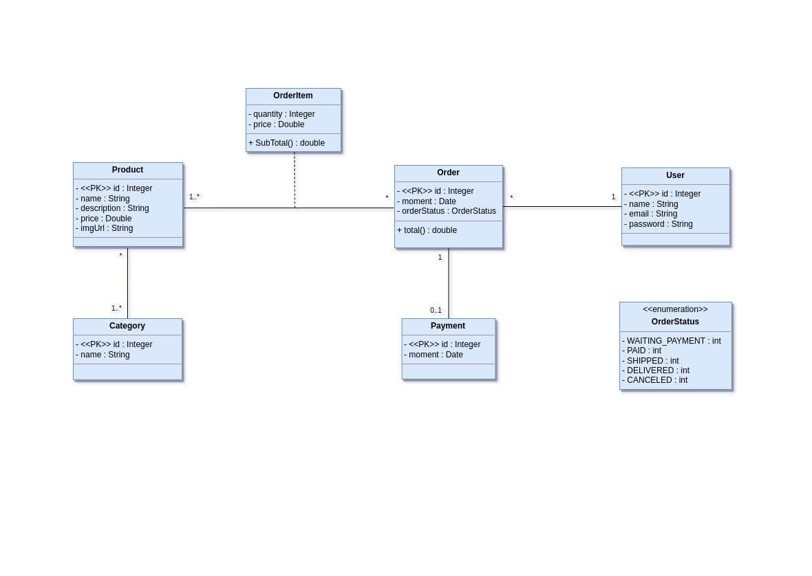

### Springboot3-jpa
> Study Web Services repository in Java with Spring Boot and JPA / Hibernate.
- **Objectives**
  - Create Project Spring Boot Java
  - Implement domain model
  - Structure logical Layers 
     - resource
     - service
     - repository
  - Configure test Database 
     - H2 database
  - Populate database
  - CRUD
    - create
    - read
    - update
    - delete
  - Exception handling
#### Domain model - diagram UML

#### Business Logic

